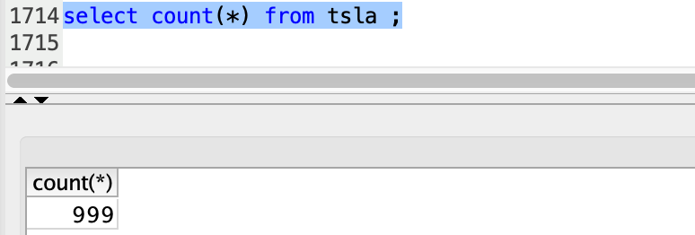

## Kafka Producer and Consumer

#### Procedure
1. Setup kafka - Download and unzip kafka tgz file. 
    - _cd kafka_2.13-2.5.0/_
2. Start ZooKeeper Server
    - _bin/zookeeper-server-start.sh config/zookeeper.properties_
3. Start Kafka Server
    - _bin/kafka-server-start.sh config/server.properties_ 
    - _Change server properties listeners, advertised.host.name and advertised.port to listen to docker_ 
4. bin/kafka-topics.sh --create --zookeeper localhost:2181 --replication-factor 1 --partitions 1 --topic part_1
5. bin/kafka-topics.sh --create --zookeeper localhost:2181 --replication-factor 1 --partitions 1 --topic part_2
6. Setup MySQL - Download mysql and install mysql. 
7. Execute **DDL.sql** scripts to create tables.
8. Clone Git
9. Run Docker commands 
```bash
docker build --no-cache -t kafka_producer_part1 -f Dockerfile_pp1 .
docker build --no-cache -t kafka_producer_part2 -f Dockerfile_pp2 .
docker build --no-cache -t kafka_consumer_part1 -f Dockerfile_cp1 .
docker build --no-cache -t kafka_consumer_part2 -f Dockerfile_cp2 .
```
10. Part 1 - Run kafka_consumer_part1 __first__ and then kafka_producer_part1
11. Part 1 - Run kafka_consumer_part2 __first__ and then kafka_producer_part2

Note :
- View data in mysql commandline or modify the sql client tool to view records in milli seconds
- tsla_orders_vw view has been created to check the latest records with order_status. 

#### Images

##### Part1:




##### kafka_processing:


##### Part2:


##### tsla_orders_vw:


